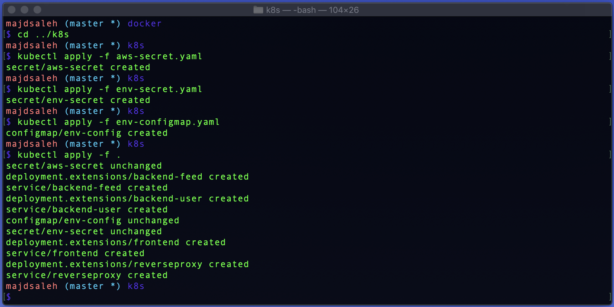
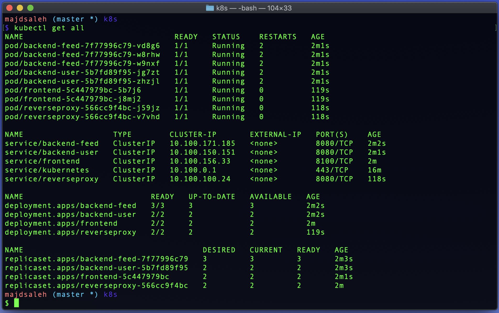
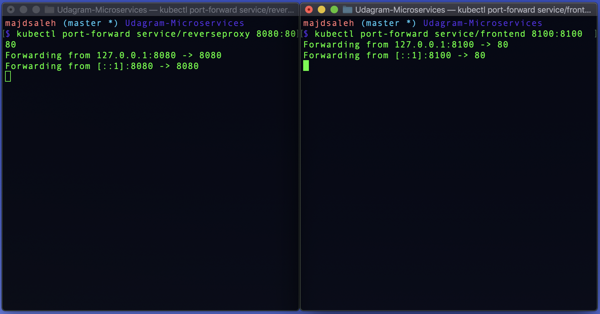
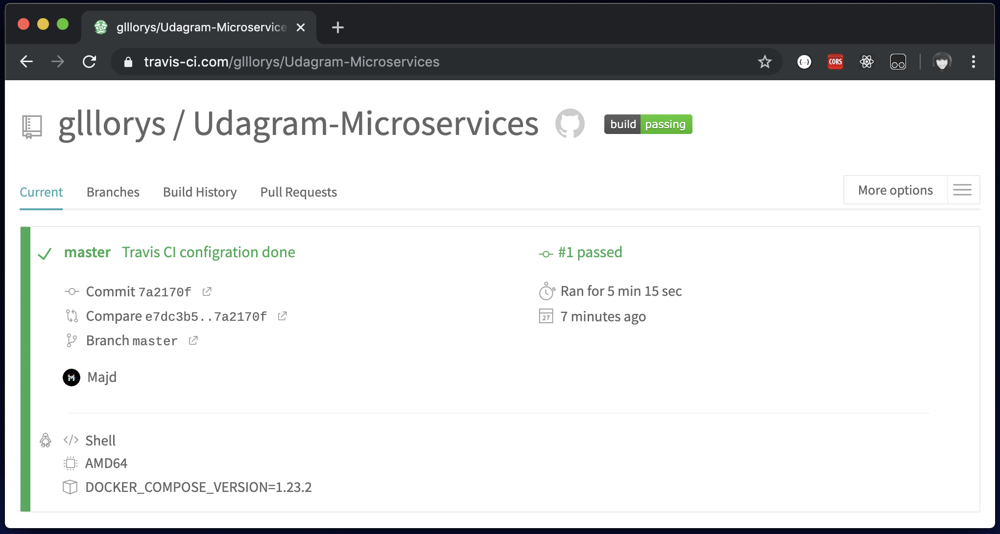

# Udagram Microservices
> Udacity Cloud Developer Nanodegree


## Getting Started
### Prerequisites
[Docker](https://docs.docker.com/docker-for-windows/install/)  
[AWS CLI](https://docs.aws.amazon.com/cli/latest/userguide/install-linux.html)  
[Eksctl](https://docs.aws.amazon.com/eks/latest/userguide/getting-started-eksctl.html)  
[AWS-iam-authenticator](https://docs.aws.amazon.com/eks/latest/userguide/install-aws-iam-authenticator.html)  
[Kubectl](https://docs.aws.amazon.com/eks/latest/userguide/install-kubectl.html)  

### Installation
`docker --version`  
`aws --version`  
`eksctl version`  
`kubectl version --short --client`  
`aws-iam-authenticator version`  

  

### Setup Environment Variables
open your bash profile to store your application variables at OS level to use them within and across applications: 
```
open ~/.profile
```

copy and paste the bash scripts bellow with your values:
```
export POSTGRESS_USERNAME=your postgress username;
export POSTGRESS_PASSWORD=your postgress password;
export POSTGRESS_DB=your postgress database;
export POSTGRESS_HOST=your postgress host;
export AWS_REGION=your aws region;
export AWS_PROFILE=your aws profile;
export AWS_BUCKET=your aws bucket name;
export JWT_SECRET=your jwt secret;
```
source your .profile to execute your bash scripts automatically whenever a new interactive shell is started:
```
source ~/.profile
```  

### Setup docker enviroment
Build the images: 
`docker-compose -f docker-compose-build.yaml build --parallel`  

  
  
List your docker images to check if they have been built:
`docker images`  

  

Run your docker containers: 
`docker-compose up`  

  

To exit run `control + C`


Push your docker images:
 `dcoker-compose -f docker-compose-build.yaml push`  

  

Check your Docker Hub, if the images reach on there:

  


### Create a Kubernetes cluster on Amazon EKS with eksctl
copy and paste the bash scripts bellow with your cluster name and configration variables:

```
eksctl create cluster \ 
--name "ClusterName" \
--version 1.14 \
--nodegroup-name standard-workers \
--node-type t3.medium \
--nodes 3 \
--nodes-min 1 \
--nodes-max 4 \
--node-ami auto
```

 
 
 ### Create Kubernetes components (configmaps and secrets)

Encrypt your database username and password using base64 using the following commands:
- `echo POSTGRESS_PASSWORD | base64`  
- `echo POSTGRESS_USERNAME | base64`  
Encrypt your aws file using base64 using the following commands:
- `cat ~/.aws/credentials | base64`  
Add these values in the appropriate places in your `env-secret.yaml`, `aws-secret.yaml`, and `env-configmap.yaml`.

 ### Setup Kubernetes Environment
 Load secret files:
- `kubectl apply -f aws-secret.yaml`
- `kubectl apply -f env-secret.yaml`
- `kubectl apply -f env-configmap.yaml`  
Apply all other yaml files:
- `kubectl apply -f .`

 

### Check your pods status

`kubectl get all`  

 

### Connect the Services with port forwarding

Use port forwarding to the frontend and reverse proxy services:
> Note: The port forwarding must be done in Separate terminals, to runn both servises at the same time.

`kubectl port-forward service/frontend 8100:8100`  
`kubectl port-forward service/reverseproxy 8080:8080`  

 

### CI/CD with TravisCL
- Sign up for [TravisCL](https://travis-ci.com) and connect your Github application repository to TrivisCL.
- Add `.travis.yml` file to the root of the application.
- Copy and paste the following code your `.travis.yml` file:
```
language: minimal

services: docker

env:
  - DOCKER_COMPOSE_VERSION=1.23.2

before_install:
  - docker -v && docker-compose -v
  - sudo rm /usr/local/bin/docker-compose
  - curl -L https://github.com/docker/compose/releases/download/${DOCKER_COMPOSE_VERSION}/docker-compose-`uname -s`-`uname -m` > docker-compose
  - chmod +x docker-compose
  - sudo mv docker-compose /usr/local/bin
  - curl -LO https://storage.googleapis.com/kubernetes-release/release/$(curl -s https://storage.googleapis.com/kubernetes-release/release/stable.txt)/bin/linux/amd64/kubectl
  - chmod +x ./kubectl
  - sudo mv ./kubectl /usr/local/bin/kubectl

install:
  - docker-compose -f udacity-c3-deployment/docker/docker-compose-build.yaml build --parallel 
```  
- Add your environment variables to the project repository in [TravisCL](https://travis-ci.com) by selecting the setting option.

- Commit and Push your changes to trigger a Travis CI build.
> Travis only runs builds on the commits you push after you’ve added a `.travis.yml` file.

- Check the build status page to see if your build passes or fails according to the return status of the build command by visiting [TravisCL](https://travis-ci.com) and selecting your repository.

 


