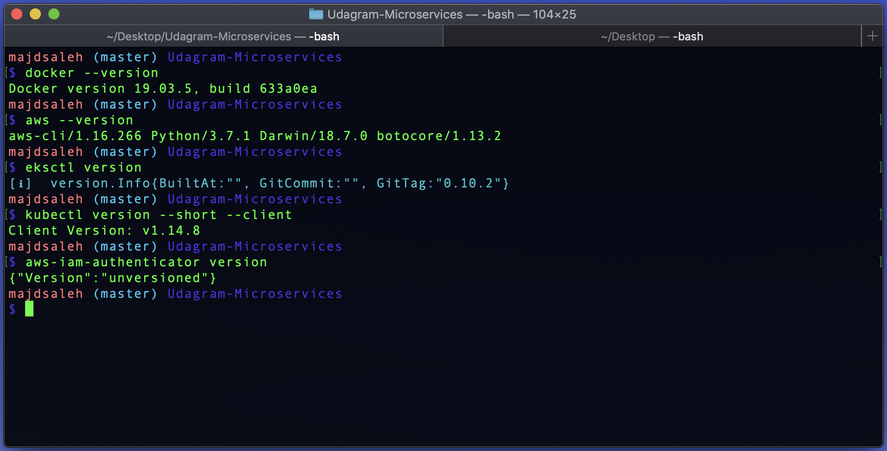
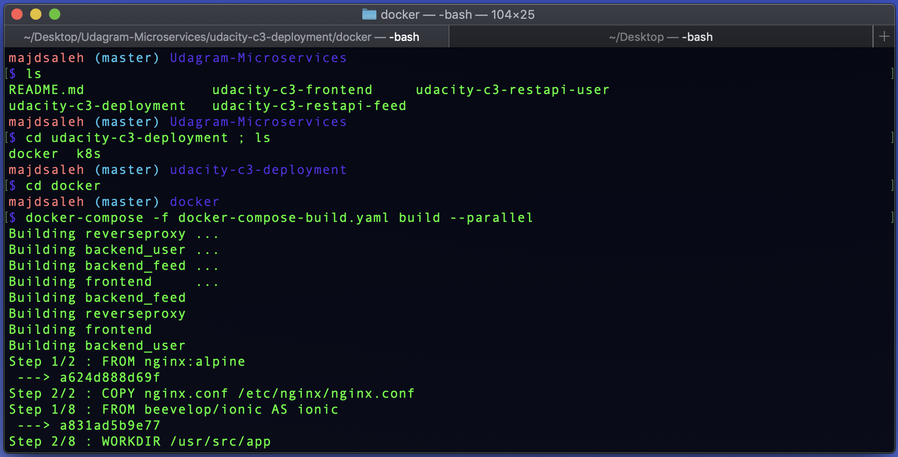
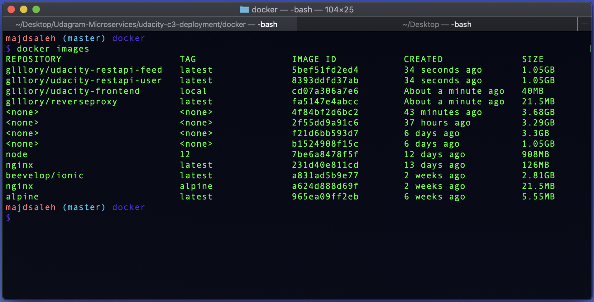
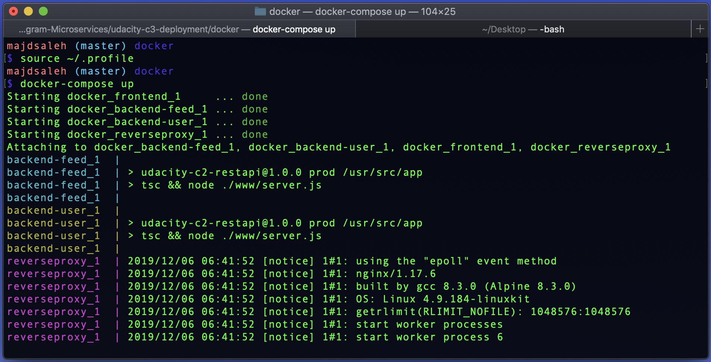
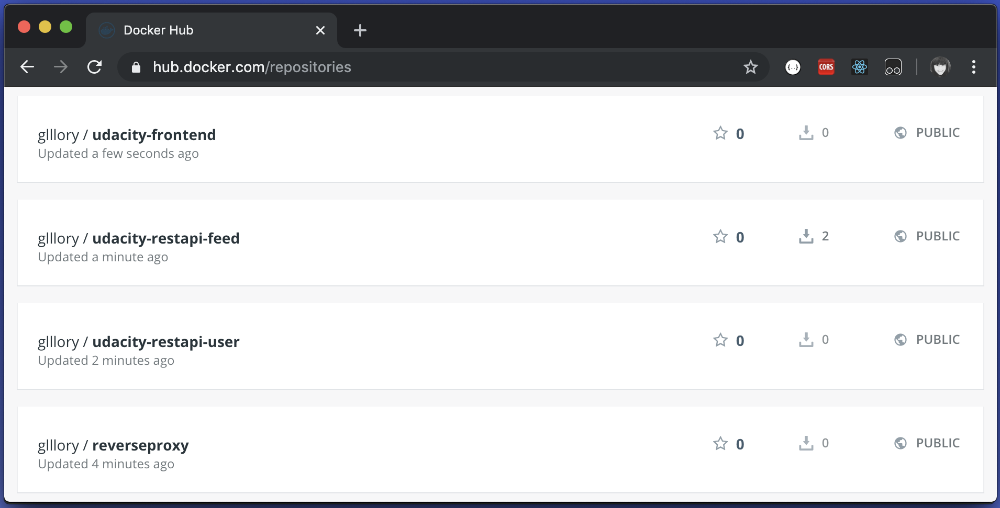
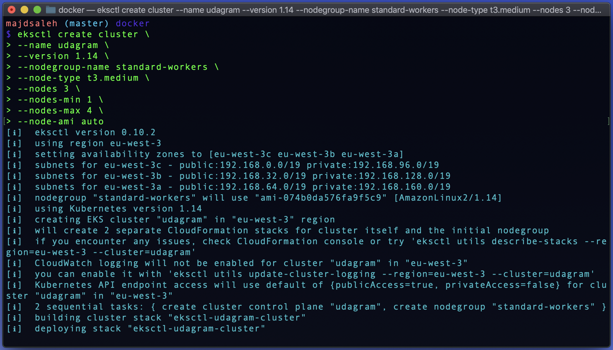

# Udagram Microservices
> Udacity Cloud Developer Nanodegree


## Getting Started
### Prerequisites
[Docker](https://docs.docker.com/docker-for-windows/install/)  
[AWS CLI](https://docs.aws.amazon.com/cli/latest/userguide/install-linux.html)  
[Eksctl](https://docs.aws.amazon.com/eks/latest/userguide/getting-started-eksctl.html)  
[AWS-iam-authenticator](https://docs.aws.amazon.com/eks/latest/userguide/install-aws-iam-authenticator.html)  
[Kubectl](https://docs.aws.amazon.com/eks/latest/userguide/install-kubectl.html)  

### Installation
`docker --version`  
`aws --version`  
`eksctl version`  
`kubectl version --short --client`  
`aws-iam-authenticator version`  

  

### Setup Environment Variables
open your bash profile to store your application variables at OS level to use them within and across applications: 
```
open ~/.profile
```

copy and paste the bash scripts bellow with your values:
```
export POSTGRESS_USERNAME=your postgress username;
export POSTGRESS_PASSWORD=your postgress password;
export POSTGRESS_DB=your postgress database;
export POSTGRESS_HOST=your postgress host;
export AWS_REGION=your aws region;
export AWS_PROFILE=your aws profile;
export AWS_BUCKET=your aws bucket name;
export JWT_SECRET=your jwt secret;
```
source your .profile to execute your bash scripts automatically whenever a new interactive shell is started:
```
source ~/.profile
```  

### Setup docker enviroment
Build the images: 
`docker-compose -f docker-compose-build.yaml build --parallel`  

  
  
List your Images to check if they have been built:
`docker images`  

  

Run your docker containers: 
`docker-compose up`  

  

To exit run `control + C`


Push the images:
 `dcoker-compose -f docker-compose-build.yaml push`  

  

Check your Docker Hub, if the Images reach on there:

  


### Creating a Kubernetes cluster on Amazon EKS with eksctl
copy and paste the bash scripts bellow with your cluster name and configration variables:

```
eksctl create cluster \ 
--name "ClusterName" \
--version 1.14 \
--nodegroup-name standard-workers \
--node-type t3.medium \
--nodes 3 \
--nodes-min 1 \
--nodes-max 4 \
--node-ami auto
```

 
 